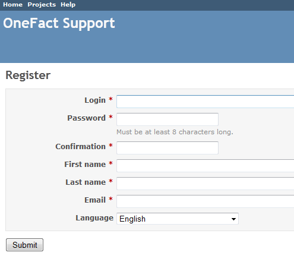
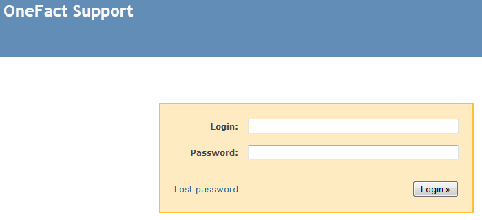
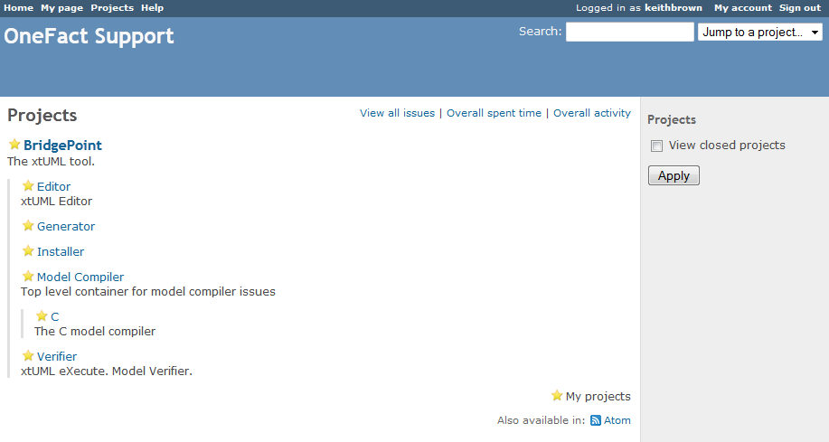
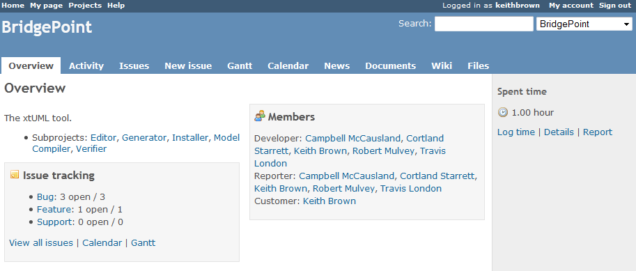
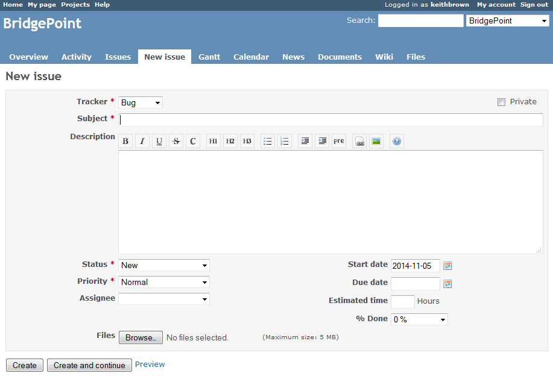

# HOWTO Create BridgePoint Issues and Feature Requests

1. Abstract
-----------
This note describes how to submit a bug report or feature request for BridgePoint using the OneFact support system.  One Fact
uses Redmine for project management and issue tracking.  The xtUML community and One Fact customers use this system.

2. Document References
----------------------
None

3. Steps
-------------
1.  Navigate to the support system here http://54.172.113.156/redmine/projects
2.  Click the Register link to create an account.

3.  Complete the registration form.  All fields are required. Click Submit.

4. Your registration will be submitted for approval.  Once approved, you will receive an e-mail notification from issues@onefact.net with a login link. Click the link to continue logging in.

5. Enter your username and password and click "Login >>"

6. You will be taken to the Projects page.

7. From here, select either the top-level BridgePoint project or one of the tool-specific subprojects.  For this example, select BridgePoint.

8. Now use the tab headers "Overview", "Activity", etc to see information about this project.
9. The "Issues" link will show all issues for the current project and its subprojects.
10. The "New issue" link will open a form that allows to submit a feature request or provide a description and reproduction steps for a bug.

  - __NOTE:__ One Fact customers may choose to make their issue "Private" by checking the box on the New Issue form.  Private issues are only viewable by the reporter and One Fact employees.
